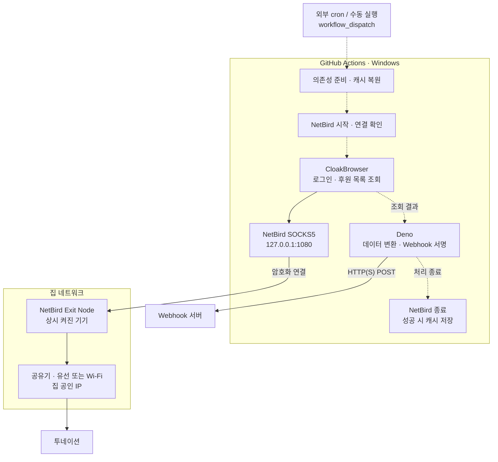

# 투네이션 후원 목록 자동 수집

투네이션 후원 내역을 수집해 Webhook으로 전송하는 Deno 스크립트입니다. 외부 cron이 GitHub Actions를 정기 실행하며, 브라우저 요청은 집 네트워크의 NetBird Exit Node를 경유합니다.

- **세션 재사용**: 저장된 브라우저 프로필을 사용하고, 세션이 만료되면 다시 로그인합니다.
- **후원 수집**: 2016-01-01부터 오늘까지의 내역을 페이지별로 조회합니다.
- **Webhook 전송**: 누적된 후원 목록에 HMAC 서명을 붙여 전송합니다.

## 동작 구조

점선은 실행 순서와 데이터 전달, 실선은 네트워크 요청입니다.



브라우저 요청에만 SOCKS5 프록시가 적용됩니다. Webhook은 Deno에서 직접 전송하며, Exit Node는 아래 NetBird 설정에서 지정합니다.

## 설정

### 1. NetBird Exit Node

계속 켜둘 수 있고 NetBird Exit Node를 지원하는 기기라면 사용할 수 있습니다. Android는 한 가지 예시이며, 집에서 사용하는 PC나 미니 PC 등으로 대체할 수 있습니다. 집 공인 IP로 접속하려면 해당 기기를 집 네트워크에 연결합니다.

1. Exit Node로 사용할 기기와 실행 환경을 같은 NetBird 네트워크에 등록합니다. 크론 실행 중 절전이나 백그라운드 제한으로 연결이 끊기지 않도록 설정합니다.
2. Exit Node용 `exit-nodes`, 실행 환경용 `github-actions` 그룹을 만듭니다. 그룹 이름은 예시입니다.
3. `github-actions` → `exit-nodes` 단방향 ICMP 허용 정책을 설정합니다.
4. 해당 기기를 `exit-nodes`에 넣고, `Peers` → `Add Exit Node`에서 다음을 설정합니다.
   - Distribution Groups: `github-actions`
   - Auto Apply: 활성화
   - Masquerade: 활성화
5. `Settings` → `Setup Keys`에서 키를 생성합니다.
   - Type: `Reusable`
   - Ephemeral Peers: 활성화
   - Auto-assign groups: `github-actions`

Actions는 실행마다 새 피어를 등록하므로 키의 만료일과 사용 횟수 제한을 확인하세요. Ephemeral 피어는 10분 넘게 오프라인이면 자동 제거됩니다.

참고: [Exit Node 설정](https://docs.netbird.io/use-cases/remote-access/exit-nodes), [Setup Key 설정](https://docs.netbird.io/manage/peers/register-machines-using-setup-keys).

### 2. 환경 변수

| 이름 | 용도 |
| --- | --- |
| `TOONATION_ID` | 투네이션 스트리머 계정 아이디 |
| `TOONATION_PASSWORD` | 계정 비밀번호 |
| `WEBHOOK_URL` | 후원 목록을 받을 URL |
| `WEBHOOK_SECRET` | 수신 서버와 공유하는 HMAC 서명 키 |
| `NETBIRD_SETUP_KEY` | Actions에서 NetBird에 등록할 Setup Key |

**GitHub Actions**에서는 저장소의 `Settings` → `Secrets and variables` → `Actions`에 위 5개 값을 등록합니다.

**로컬 실행**에서는 프로젝트 루트에 `.env`를 만듭니다. Setup Key는 아래 Docker 실행 시 별도로 입력합니다.

```dotenv
TOONATION_ID=your_toonation_id
TOONATION_PASSWORD=your_toonation_password
WEBHOOK_URL=https://your.service.example.com/toonation/webhook
WEBHOOK_SECRET=your_webhook_secret
```

## 실행

### GitHub Actions

GitHub Actions 자체 스케줄이 불안정해 외부 cron으로 전환했습니다. 실행 주기는 외부 cron에서 관리하며, [Workflow dispatch API](https://docs.github.com/ko/rest/actions/workflows?apiVersion=2026-03-10#create-a-workflow-dispatch-event)로 `cron.yml`을 실행합니다.

외부 cron은 `POST /repos/{owner}/{repo}/actions/workflows/cron.yml/dispatches`를 호출하며, 요청 본문의 `ref`에 실행할 브랜치 또는 태그를 지정합니다. 세분화된 토큰을 사용한다면 대상 저장소의 `Actions: write` 권한이 필요합니다.

`Actions` → `Cron` → `Run workflow`로 수동 실행할 수 있습니다.

| 항목 | 설정 |
| --- | --- |
| 정기 실행 | 외부 cron에서 `workflow_dispatch` 호출 |
| 실행 환경 | Windows 2025, Deno 2.7.11 |
| 프록시 | NetBird 0.79.0 직접 실행 · netstack SOCKS5 |
| 캐시 | 브라우저 바이너리와 로그인 프로필 재사용 |
| 제한 시간 | NetBird 연결과 크롤링 단계에 10분 |

세부 설정은 [cron.yml](.github/workflows/cron.yml)에 있습니다. 프록시 통신 확인 후 크롤링을 시작하며, 종료 시 NetBird 프로세스를 정리합니다.

### 로컬 실행(macOS + Docker)

Deno와 Docker가 필요합니다. 브라우저는 Mac에서 화면을 표시하며 실행됩니다.

**1. NetBird 프록시 시작**

Docker를 실행한 뒤 zsh에서 Setup Key를 입력합니다.

```zsh
read -rs "NB_SETUP_KEY?NetBird Setup Key: "
echo
export NB_SETUP_KEY

docker run --detach \
  --name netbird-local \
  --hostname toonation-local \
  --publish 127.0.0.1:1080:1080 \
  --env NB_SETUP_KEY \
  --env NB_USE_NETSTACK_MODE=true \
  --env NB_SOCKS5_LISTENER_ADDRESS=0.0.0.0 \
  netbirdio/netbird:0.79.0-rootless

unset NB_SETUP_KEY
```

SOCKS5는 인증이 없으므로 호스트에는 `127.0.0.1:1080`으로만 공개합니다.

**2. 연결 확인 후 수집 실행**

```bash
docker exec netbird-local netbird status
docker exec netbird-local netbird networks ls
```

설정한 Exit Node 경로가 선택되어 있으면 프로젝트 폴더에서 실행합니다. 필요한 의존성과 브라우저는 첫 실행 시 자동으로 다운로드됩니다.

```bash
deno task start
```

`.env`를 읽어 후원 내역을 수집하고 Webhook으로 전송합니다. 로그인 프로필은 `.cache/toonation-profile`에 저장됩니다. 파일 변경 시 재실행하려면 `deno task dev`를 사용합니다.

**3. 프록시 종료**

```bash
docker rm --force netbird-local
```

다시 사용할 때는 1번부터 실행합니다.

## Webhook 연동

`WEBHOOK_URL`로 아래 형식의 JSON 배열을 POST 전송합니다.

```json
[
  {
    "account": "acc123",
    "nickname": "닉네임",
    "amount": 5000,
    "message": "응원합니다!",
    "createdAt": "2024-05-10T09:15:27.123Z"
  }
]
```

| 응답 | 처리 |
| --- | --- |
| 2xx | 수집 종료 |
| 404 + 본문 `not-found-last-donation` | 다음 페이지를 추가해 누적 목록 재전송 |
| 그 외 오류 | 실행 실패 |

현재 구현에서는 추가 페이지 조회가 끝나도 최초 404를 오류로 처리합니다.

<details>
<summary>서명 검증 방법</summary>

요청에는 다음 헤더가 포함됩니다.

- `Content-Type: application/json`
- `X-Signature-Timestamp`: Unix 타임스탬프(초)
- `X-Signature-Sha256`: HMAC-SHA256 서명(hex)

수신 서버는 JSON 파싱 전의 원본 본문으로 서명을 계산합니다.

```text
HMAC_SHA256_HEX(WEBHOOK_SECRET, timestamp + rawBody)
```

타임스탬프가 허용 범위(예: 300초) 안인지 확인하고, 서명을 constant-time 방식으로 비교한 뒤 데이터를 처리합니다. 구현은 [webhook.ts](webhook.ts)를 참고하세요.

</details>

## 문제 해결

| 증상 | 확인할 내용 |
| --- | --- |
| `ERR_PROXY_CONNECTION_FAILED` | `127.0.0.1:1080` 프록시 실행 여부 |
| `NetBird login failed` | Setup Key 만료·폐기·사용 횟수 제한 |
| NetBird 연결 후 요청 실패 | Exit Node 기기의 네트워크 연결, 경로 선택, 그룹과 접근 정책 |
| 로그인 실패·화면 대기 초과 | 계정 정보, 캡차·2단계 인증, 페이지 구조 변경 |
| Webhook 401/403 | 공유 서명 키, 원본 본문, 타임스탬프 |

집 공인 IP는 같은 SOCKS5 프록시를 지정해 별도로 확인하세요. Actions의 통신 검사는 IP를 비교하지 않으며, Exit Node와 같은 집 네트워크에서 테스트하면 직접 연결도 같은 IP를 사용합니다.

<details>
<summary>로그와 주요 파일</summary>

Actions의 NetBird 로그는 `%PROGRAMDATA%\Netbird\client.log`에 기록됩니다. 표준 출력과 오류는 러너 임시 디렉토리의 `netbird/service.log`, `netbird/service-error.log`에 기록됩니다.

| 파일 | 역할 |
| --- | --- |
| [main.ts](main.ts) | 브라우저 실행, 로그인, 수집·전송 |
| [toonation.ts](toonation.ts) | 후원 목록 API 조회 |
| [webhook.ts](webhook.ts) | Webhook 서명 및 전송 |
| [config.ts](config.ts) | 환경 변수 검증 |
| [.github/workflows/cron.yml](.github/workflows/cron.yml) | 외부 호출·수동 실행, NetBird, 캐시 |

</details>
